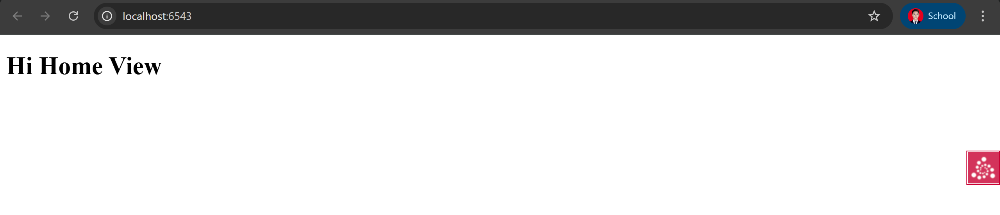

# 09: Organizing Views With View Classes

## Deskripsi Singkat  
Pada langkah ini kita akan mengubah view-functions yang sebelumnya berdiri sendiri menjadi metode-metode dalam sebuah *view class*. Dengan demikian kita dapat:  
- Mengelompokkan view yang terkait ke dalam satu kelas.  
- Menyederhanakan konfigurasi bersama dengan `@view_defaults`.  
- Berbagi state atau helper di antara metode-metode view dalam kelas tersebut.  
> “Change our view functions to be methods on a view class, then move some declarations to the class level.”  
([docs.pylonsproject.org](https://docs.pylonsproject.org/projects/pyramid/en/latest/quick_tutorial/view_classes.html)) :contentReference[oaicite:1]{index=1}

## Output



---

## Tujuan  
- Mengelompokkan view yang terkait ke dalam satu kelas. :contentReference[oaicite:2]{index=2}  
- Memusatkan konfigurasi default menggunakan `@view_defaults`. :contentReference[oaicite:3]{index=3}  
- Memodifikasi tes unit dan fungsional agar sesuai dengan pendekatan view-class. :contentReference[oaicite:4]{index=4}  

---

## Langkah-Langkah  
1. Salin hasil proyek dari langkah sebelumnya (08: Templating) ke direktori baru:  
   ```bash
   cd ..; cp -r templating view_classes; cd view_classes
   $VENV/bin/pip install -e .
   ``` :contentReference[oaicite:5]{index=5}  
2. Ubah file `tutorial/views.py` menjadi sebuah kelas seperti berikut:  
   ```python
   from pyramid.view import view_config, view_defaults

   @view_defaults(renderer='home.pt')
   class TutorialViews:
       def __init__(self, request):
           self.request = request

       @view_config(route_name='home')
       def home(self):
           return {'name': 'Home View'}

       @view_config(route_name='hello')
       def hello(self):
           return {'name': 'Hello View'}
   ``` :contentReference[oaicite:6]{index=6}  
3. Ubah atau sesuaikan file tes unit di `tutorial/tests.py` agar menguji kelas view ini. Contoh:  
   ```python
   import unittest
   from pyramid import testing

   class TutorialViewTests(unittest.TestCase):
       def setUp(self):
           self.config = testing.setUp()

       def tearDown(self):
           testing.tearDown()

       def test_home(self):
           from tutorial.views import TutorialViews
           request = testing.DummyRequest()
           inst = TutorialViews(request)
           response = inst.home()
           self.assertEqual('Home View', response['name'])

       def test_hello(self):
           from tutorial.views import TutorialViews
           request = testing.DummyRequest()
           inst = TutorialViews(request)
           response = inst.hello()
           self.assertEqual('Hello View', response['name'])
   ``` :contentReference[oaicite:7]{index=7}  
4. Ubah atau sesuaikan tes fungsional agar masih berjalan-baik dengan view class:  
   ```python
   import unittest
   from tutorial import main
   from webtest import TestApp

   class TutorialFunctionalTests(unittest.TestCase):
       def setUp(self):
           app = main({})
           self.testapp = TestApp(app)

       def test_home(self):
           res = self.testapp.get('/', status=200)
           self.assertIn(b'<h1>Hi Home View', res.body)

       def test_hello(self):
           res = self.testapp.get('/howdy', status=200)
           self.assertIn(b'<h1>Hi Hello View', res.body)
   ``` :contentReference[oaicite:8]{index=8}  
5. Jalankan tes:  
   ```bash
   $VENV/bin/pytest tutorial/tests.py -q
````

Hasil yang diharapkan:

````
....
4 passed in 0.34 seconds
``` :contentReference[oaicite:9]{index=9}  
6. Jalankan aplikasi dengan:  
```bash
$VENV/bin/pserve development.ini --reload
````

Buka browser ke:

* [http://localhost:6543/](http://localhost:6543/)
* [http://localhost:6543/howdy](http://localhost:6543/howdy)

---

## Analisis

* Dengan mengonversi fungsi view menjadi metode dalam sebuah kelas (`TutorialViews`), kita memperoleh organisasi kode yang lebih bersih dan modular. ([Pylons Project Documentation][1])
* `@view_defaults(renderer='home.pt')` pada kelas memungkinkan kita menyetapkan renderer default bagi seluruh metode view dalam kelas tersebut — menghindari pengulangan. ([Pylons Project Documentation][1])
* View class memberi peluang untuk berbagi state (`self.request`) atau helper method di antara view–method yang berbeda. Ini cocok jika view–view itu terkait erat.
* Tes unit harus diperbarui karena view sekarang adalah metode kelas — kita membuat instance kelas dengan `request` dummy dan memanggil metode yang diuji. ([Pylons Project Documentation][1])
* Tes fungsional tetap berjalan karena routing dan template masih sama — hanya implementasi view diubah.
* Ini adalah langkah minimal yang memperkenalkan view class — tanpa menambah fitur baru, hanya reorganisasi kode. ([Pylons Project Documentation][1])

---

## Output yang Diharapkan

* Setelah semuanya dijalankan, tes unit/fungsional akan menunjukkan bahwa view home dan hello bekerja:

  ```
  ....
  4 passed in 0.34 seconds
  ```
* Di browser:

  * Akses `http://localhost:6543/` → halaman dengan `Home View`.
  * Akses `http://localhost:6543/howdy` → halaman dengan `Hello View`.
* Struktur proyek kira-kira:

  ```
  view_classes/
    setup.py
    development.ini
    tutorial/
      __init__.py
      views.py
      tests.py
      home.pt
      ...
  ```