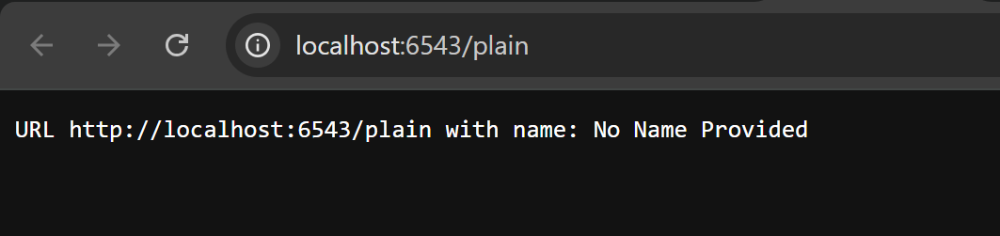

# 10: Handling Web Requests and Responses

## 📘 Deskripsi Singkat
Langkah ini menjelaskan bagaimana **Pyramid** menangani permintaan web (*request*) dan menghasilkan tanggapan (*response*).  
Pyramid menggunakan library **WebOb** sebagai fondasi untuk objek `Request` dan `Response`, memungkinkan kita untuk dengan mudah:
- Mengambil data dari request (misalnya query string `?name=alice`)
- Mengubah atau menetapkan informasi di response (seperti header, content-type, dan body)
- Melakukan redirect dengan `HTTPFound`

---

## 🎯 Tujuan
- Memahami mekanisme request dan response dalam Pyramid.  
- Mengambil data dari parameter request (`request.params`).  
- Mengatur konten dan header di response.  
- Melakukan *redirect* antar route.  

---

## ⚙️ Langkah-Langkah Implementasi

### 1️⃣ Siapkan Direktori Proyek
Salin proyek sebelumnya (`view_classes`) ke direktori baru:
```bash
cd ..; cp -r view_classes request_response; cd request_response
$VENV/bin/pip install -e .
````

---

### 2️⃣ Ubah Konfigurasi Route (`tutorial/__init__.py`)

```python
from pyramid.config import Configurator

def main(global_config, **settings):
    config = Configurator(settings=settings)
    config.add_route('home', '/')
    config.add_route('plain', '/plain')
    config.scan('.views')
    return config.make_wsgi_app()
```

---

### 3️⃣ Buat View Class (`tutorial/views.py`)

```python
from pyramid.httpexceptions import HTTPFound
from pyramid.response import Response
from pyramid.view import view_config

class TutorialViews:
    def __init__(self, request):
        self.request = request

    @view_config(route_name='home')
    def home(self):
        # Redirect ke /plain
        return HTTPFound(location='/plain')

    @view_config(route_name='plain')
    def plain(self):
        # Ambil parameter ?name dari URL
        name = self.request.params.get('name', 'No Name Provided')
        body = f'URL {self.request.url} with name: {name}'
        return Response(
            content_type='text/plain',
            body=body
        )
```

---

### 4️⃣ Tambahkan Unit Test (`tutorial/tests.py`)

```python
import unittest
from pyramid import testing

class TutorialViewTests(unittest.TestCase):
    def setUp(self):
        self.config = testing.setUp()

    def tearDown(self):
        testing.tearDown()

    def test_home(self):
        from .views import TutorialViews
        request = testing.DummyRequest()
        inst = TutorialViews(request)
        response = inst.home()
        self.assertEqual(response.status, '302 Found')

    def test_plain_without_name(self):
        from .views import TutorialViews
        request = testing.DummyRequest()
        inst = TutorialViews(request)
        response = inst.plain()
        self.assertIn(b'No Name Provided', response.body)

    def test_plain_with_name(self):
        from .views import TutorialViews
        request = testing.DummyRequest()
        request.GET['name'] = 'Jane Doe'
        inst = TutorialViews(request)
        response = inst.plain()
        self.assertIn(b'Jane Doe', response.body)


class TutorialFunctionalTests(unittest.TestCase):
    def setUp(self):
        from tutorial import main
        from webtest import TestApp
        app = main({})
        self.testapp = TestApp(app)

    def test_plain_without_name(self):
        res = self.testapp.get('/plain', status=200)
        self.assertIn(b'No Name Provided', res.body)

    def test_plain_with_name(self):
        res = self.testapp.get('/plain?name=Jane%20Doe', status=200)
        self.assertIn(b'Jane Doe', res.body)
```

---

### 5️⃣ Jalankan Tes

```bash
$VENV/bin/pytest tutorial/tests.py -q
```

Hasil yang diharapkan:

```
.....
5 passed in 0.30 seconds
```

---

### 6️⃣ Jalankan Aplikasi

```bash
$VENV/bin/pserve development.ini --reload
```

Lalu buka browser ke:

* [http://localhost:6543/](http://localhost:6543/) → akan redirect ke `/plain`
* [http://localhost:6543/plain?name=alice](http://localhost:6543/plain?name=alice) → menampilkan teks:

  ```
  URL http://localhost:6543/plain?name=alice with name: alice
  ```

---

## 🧠 Analisis

* **Redirect dengan `HTTPFound`**
  Pyramid memungkinkan redirect dengan `return HTTPFound(location='/target')` atau `raise HTTPFound(...)`.
  Ini memberi fleksibilitas untuk berpindah antar route dengan cara eksplisit dan aman.

* **Mengambil Data Request**
  Kita menggunakan `self.request.params.get('name')` untuk mengambil parameter dari query string.
  Jika parameter tidak ada, kita beri nilai default `"No Name Provided"`.

* **Membangun Response Manual**
  Dengan `Response(content_type='text/plain', body=...)`, kita dapat membuat tanggapan HTTP lengkap — termasuk tipe konten, body, dan status code.

* **Testing**
  Unit test memastikan view bekerja sesuai logika (redirect dan parameter).
  Functional test memastikan aplikasi berperilaku benar dari sisi pengguna (HTTP GET).

---

## 🧩 Struktur Akhir Proyek

```
request_response/
│
├── development.ini
├── setup.py
└── tutorial/
    ├── __init__.py
    ├── views.py
    ├── tests.py
    └── templates/
```

---

## 📊 Output yang Diharapkan

* Saat membuka `/`, browser otomatis diarahkan ke `/plain`.
* Jika URL `/plain` diakses tanpa parameter:

  ```
  URL http://localhost:6543/plain with name: No Name Provided
  ```
* Jika URL `/plain?name=alice` diakses:

  ```
  URL http://localhost:6543/plain?name=alice with name: alice
  ```
* Semua test (`pytest`) lulus ✅



---

## 🏁 Kesimpulan

Bagian ini menunjukkan bagaimana Pyramid menangani **request dan response** menggunakan **WebOb** secara efisien.
Kita belajar:

* Mengambil parameter dari request
* Mengembalikan response yang dikustomisasi
* Melakukan redirect antar halaman
* Menguji alur request–response dengan unit dan functional test

```
```
