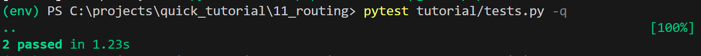
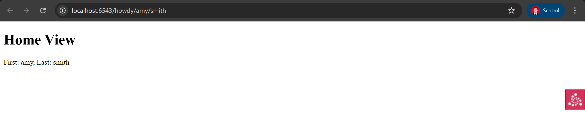

# 11: Dispatching URLs To Views With Routing

## 📘 Deskripsi Singkat
Bagian ini membahas bagaimana **Pyramid** menangani routing, yaitu proses mencocokkan pola URL dengan view tertentu. Dengan routing, kita dapat mengekstrak bagian dari URL dan menggunakannya sebagai data dinamis dalam aplikasi.

---

## ⚙️ Langkah-Langkah

### 1. Buat Direktori Baru
Salin hasil dari langkah `view_classes`:
```bash
cd ..; cp -r view_classes routing; cd routing
$VENV/bin/pip install -e .
````

---

### 2. Tambahkan Route di `routing/tutorial/__init__.py`

```python
from pyramid.config import Configurator

def main(global_config, **settings):
    config = Configurator(settings=settings)
    config.include('pyramid_chameleon')
    config.add_route('home', '/howdy/{first}/{last}')
    config.scan('.views')
    return config.make_wsgi_app()
```

---

### 3. Buat View di `routing/tutorial/views.py`

```python
from pyramid.view import (
    view_config,
    view_defaults
)

@view_defaults(renderer='home.pt')
class TutorialViews:
    def __init__(self, request):
        self.request = request

    @view_config(route_name='home')
    def home(self):
        first = self.request.matchdict['first']
        last = self.request.matchdict['last']
        return {
            'name': 'Home View',
            'first': first,
            'last': last
        }
```

---

### 4. Tambahkan Template `routing/tutorial/home.pt`

```html
<!DOCTYPE html>
<html lang="en">
<head>
    <title>Quick Tutorial: ${name}</title>
</head>
<body>
    <h1>${name}</h1>
    <p>First: ${first}, Last: ${last}</p>
</body>
</html>
```

---

### 5. Tambahkan Unit Test di `routing/tutorial/tests.py`

```python
import unittest
from pyramid import testing

class TutorialViewTests(unittest.TestCase):
    def setUp(self):
        self.config = testing.setUp()

    def tearDown(self):
        testing.tearDown()

    def test_home(self):
        from .views import TutorialViews
        request = testing.DummyRequest()
        request.matchdict['first'] = 'First'
        request.matchdict['last'] = 'Last'
        inst = TutorialViews(request)
        response = inst.home()
        self.assertEqual(response['first'], 'First')
        self.assertEqual(response['last'], 'Last')


class TutorialFunctionalTests(unittest.TestCase):
    def setUp(self):
        from tutorial import main
        app = main({})
        from webtest import TestApp
        self.testapp = TestApp(app)

    def test_home(self):
        res = self.testapp.get('/howdy/Jane/Doe', status=200)
        self.assertIn(b'Jane', res.body)
        self.assertIn(b'Doe', res.body)
```

---

### 6. Jalankan Unit Test

```bash
$VENV/bin/pytest tutorial/tests.py -q
..
2 passed in 0.39 seconds
```

---

### 7. Jalankan Aplikasi

```bash
$VENV/bin/pserve development.ini --reload
```

---

### 8. Akses di Browser

Buka di browser:

```
http://localhost:6543/howdy/amy/smith
```

---

## 🔍 Analisis

Pada file `__init__.py`, route berikut menambahkan **pattern dinamis** ke URL:

```python
config.add_route('home', '/howdy/{first}/{last}')
```

Ketika pengguna mengunjungi `/howdy/amy/smith`, maka:

* `first = 'amy'`
* `last = 'smith'`

Nilai ini disimpan dalam `request.matchdict`, yang kemudian dapat digunakan dalam view:

```python
self.request.matchdict['first']
self.request.matchdict['last']
```

Dengan ini, Pyramid memungkinkan pembuatan URL yang dinamis dan fleksibel untuk menampilkan data berdasarkan parameter di URL.

---

## ✅ Output yang Diharapkan





Ketika mengunjungi:

```
http://localhost:6543/howdy/amy/smith
```

Hasil yang ditampilkan di browser:

```html
<h1>Home View</h1>
<p>First: amy, Last: smith</p>
```
