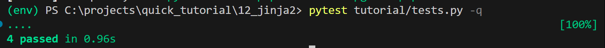
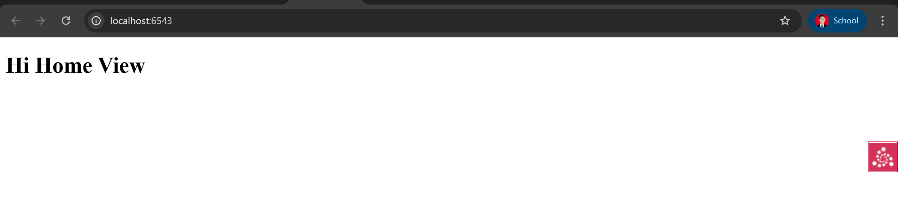

# 🎨 12: Templating With Jinja2

## 📘 Deskripsi Singkat
Pada tahap ini, kita akan belajar bagaimana menggunakan **Jinja2** sebagai sistem templating di aplikasi **Pyramid**.  
Jinja2 adalah templating engine populer yang digunakan oleh Flask dan terinspirasi dari Django Templates.  
Dengan menambahkan add-on `pyramid_jinja2`, Pyramid dapat merender template `.jinja2` dengan mudah.

## Output





---

## 🎯 Tujuan Pembelajaran
- Memahami cara mengintegrasikan **Jinja2** dalam aplikasi Pyramid.  
- Mengetahui perbedaan konfigurasi antara **Chameleon** dan **Jinja2**.  
- Mampu membuat view dan template menggunakan **Jinja2 renderer**.

---

## ⚙️ Langkah-Langkah Implementasi

### 1️⃣ Persiapan Proyek
Kita akan melanjutkan dari langkah sebelumnya (`09: View Classes`).  
Salin direktori proyek agar tidak mengubah versi sebelumnya:

```bash
cd ..
cp -r view_classes jinja2
cd jinja2
````

---

### 2️⃣ Tambahkan Dependensi `pyramid_jinja2`

Edit file `setup.py` agar mendukung Jinja2 sebagai renderer tambahan.

```python
from setuptools import setup

requires = [
    'pyramid',
    'pyramid_chameleon',
    'pyramid_jinja2',
    'waitress',
]

dev_requires = [
    'pyramid_debugtoolbar',
    'pytest',
    'webtest',
]

setup(
    name='tutorial',
    install_requires=requires,
    extras_require={
        'dev': dev_requires,
    },
    entry_points={
        'paste.app_factory': [
            'main = tutorial:main'
        ],
    },
)
```

📘 **Penjelasan:**

* `pyramid_jinja2` ditambahkan ke dalam daftar dependensi utama (`install_requires`).
* Dependensi ini memungkinkan Pyramid untuk mengenali file `.jinja2` sebagai template renderer.

---

### 3️⃣ Instalasi Dependensi

Setelah mengubah `setup.py`, install ulang proyek dengan:

```bash
$VENV/bin/pip install -e .
```

Output yang diharapkan:

```
Obtaining file:///path/to/jinja2
Installing collected packages: pyramid_jinja2, tutorial
Successfully installed pyramid_jinja2 tutorial
```

---

### 4️⃣ Konfigurasi Aplikasi (`tutorial/__init__.py`)

Tambahkan `pyramid_jinja2` ke konfigurasi agar Pyramid mengenal renderer baru:

```python
from pyramid.config import Configurator

def main(global_config, **settings):
    config = Configurator(settings=settings)
    config.include('pyramid_jinja2')
    config.add_route('home', '/')
    config.add_route('hello', '/howdy')
    config.scan('.views')
    return config.make_wsgi_app()
```

📘 **Catatan:**
`config.include('pyramid_jinja2')` adalah kunci utama untuk mengaktifkan dukungan template Jinja2.

---

### 5️⃣ Buat View Menggunakan View Class (`tutorial/views.py`)

Ubah `renderer` menjadi `home.jinja2` agar view dapat dirender dengan template Jinja2.

```python
from pyramid.view import (
    view_config,
    view_defaults
)

@view_defaults(renderer='home.jinja2')
class TutorialViews:
    def __init__(self, request):
        self.request = request

    @view_config(route_name='home')
    def home(self):
        return {'name': 'Home View'}

    @view_config(route_name='hello')
    def hello(self):
        return {'name': 'Hello View'}
```

📘 **Penjelasan:**

* `renderer='home.jinja2'` menentukan bahwa hasil view akan dirender menggunakan file `home.jinja2`.
* `return {'name': 'Home View'}` mengirimkan data ke template.

---

### 6️⃣ Buat Template `tutorial/home.jinja2`

Tambahkan file berikut:

```html
<!DOCTYPE html>
<html lang="en">
<head>
    <title>Quick Tutorial: {{ name }}</title>
</head>
<body>
    <h1>Hi {{ name }}</h1>
</body>
</html>
```

📘 **Catatan:**

* Sintaks `{{ name }}` digunakan untuk menampilkan variabel dari view.
* Jinja2 memiliki sintaks yang hampir sama dengan Chameleon untuk ekspresi dasar.

---

### 7️⃣ Jalankan Tes Otomatis

Gunakan `pytest` untuk memastikan semua konfigurasi berjalan baik:

```bash
$VENV/bin/pytest tutorial/tests.py -q
```

Output yang diharapkan:

```
....
4 passed in 0.40 seconds
```

---

### 8️⃣ Jalankan Aplikasi

Gunakan perintah berikut untuk menjalankan Pyramid:

```bash
$VENV/bin/pserve development.ini --reload
```

Kemudian buka di browser:
👉 [http://localhost:6543/](http://localhost:6543/)

---

## 🧠 Analisis

### 🔹 Integrasi Add-on Pyramid

Integrasi `pyramid_jinja2` sangat mudah:

1. Install package di virtual environment.
2. Sertakan dengan `config.include('pyramid_jinja2')`.
3. Gunakan ekstensi `.jinja2` di renderer view.

Langkah ini membuat Pyramid fleksibel untuk berbagai engine templating.

---

### 🔹 Perbandingan Jinja2 dan Chameleon

| Aspek       | Chameleon                         | Jinja2                          |
| ----------- | --------------------------------- | ------------------------------- |
| Sintaks     | XML-like (TAL expressions)        | Pythonic ({{ variable }})       |
| Popularitas | Khas Pyramid                      | Digunakan luas di Flask         |
| Kelebihan   | Integrasi mendalam dengan Pyramid | Sintaks sederhana dan ekspresif |

---

### 🔹 Keuntungan Menggunakan Jinja2

* Lebih familier bagi developer Python/Flask.
* Mendukung inheritance dan macro.
* Tersedia banyak dokumentasi dan ekstensi komunitas.

---

## 📋 Struktur Akhir Proyek

```
jinja2/
│
├── setup.py
├── development.ini
└── tutorial/
    ├── __init__.py
    ├── views.py
    ├── home.jinja2
    ├── static/
    └── templates/
```

---

## ✅ Kesimpulan

Dalam bagian ini, kamu telah belajar untuk:

* Menginstal dan mengaktifkan **Jinja2** di Pyramid.
* Menggunakan **renderer .jinja2** untuk menghasilkan HTML.
* Memahami struktur view dan template pada Pyramid.
* Menguji aplikasi agar tetap stabil dan modular.

---
