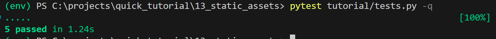
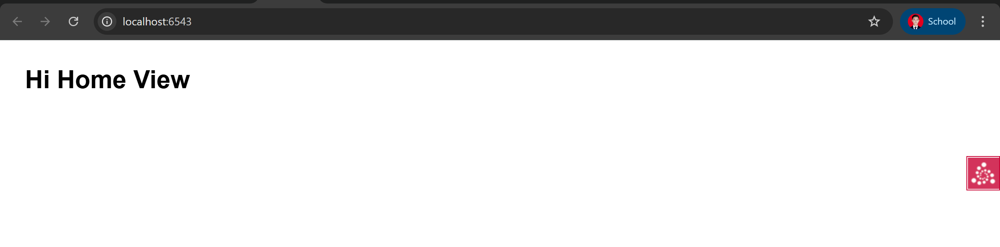

# 13: CSS/JS/Images Files With Static Assets

## 📘 Deskripsi Singkat  
Aplikasi web tidak hanya soal HTML dinamis — kita juga butuh berkas statis seperti CSS, JavaScript, dan gambar (images).  
Dalam langkah ini kita akan mengatur agar Pyramid dapat melayani direktori aset statis tersebut dan kita akan menggunakan API khusus untuk menghasilkan URL ke berkas-berkas statis secara aman.  
([Tutorial Static Assets](https://docs.pylonsproject.org/projects/pyramid/en/latest/quick_tutorial/static_assets.html)) :contentReference[oaicite:1]{index=1}

---
## Output




## 🎯 Tujuan  
- Memublikasikan direktori aset statis (CSS/JS/Images) di URL aplikasi. :contentReference[oaicite:2]{index=2}  
- Menggunakan API `request.static_url()` agar URL ke berkas statis fleksibel dan tidak “hard-coded”. :contentReference[oaicite:3]{index=3}  

---

## ⚙️ Langkah-Langkah  
1. Salin hasil dari langkah sebelumnya (“view_classes”) ke direktori baru:  
   ```bash
   cd ..; cp -r view_classes static_assets; cd static_assets
   $VENV/bin/pip install -e .
   ``` :contentReference[oaicite:4]{index=4}  
2. Tambahkan panggilan `config.add_static_view` di file `static_assets/tutorial/__init__.py`, misalnya:  
   ```python
   from pyramid.config import Configurator

   def main(global_config, **settings):
       config = Configurator(settings=settings)
       config.include('pyramid_chameleon')
       config.add_route('home', '/')
       config.add_route('hello', '/howdy')
       config.add_static_view(name='static', path='tutorial:static')
       config.scan('.views')
       return config.make_wsgi_app()
   ``` :contentReference[oaicite:5]{index=5}  
3. Tambahkan link CSS (atau JS) pada template—misalnya di `static_assets/tutorial/home.pt`:  
   ```html
   <!DOCTYPE html>
   <html lang="en">
   <head>
       <title>Quick Tutorial: ${name}</title>
       <link rel="stylesheet"
             href="${request.static_url('tutorial:static/app.css')}"/>
   </head>
   <body>
       <h1>Hi ${name}</h1>
   </body>
   </html>
   ``` :contentReference[oaicite:6]{index=6}  
4. Tambahkan berkas CSS di direktori `static_assets/tutorial/static/app.css`:  
   ```css
   body {
     margin: 2em;
     font-family: sans-serif;
   }
   ``` :contentReference[oaicite:7]{index=7}  
5. Tambahkan tes fungsional yang memeriksa bahwa berkas statis disajikan (delivered):  
   ```python
   def test_css(self):
       res = self.testapp.get('/static/app.css', status=200)
       self.assertIn(b'body', res.body)
   ``` :contentReference[oaicite:8]{index=8}  
6. Jalankan tes:  
   ```bash
   $VENV/bin/pytest tutorial/tests.py -q
````

Hasil yang diharapkan:

````
....
5 passed in 0.50 seconds
``` :contentReference[oaicite:9]{index=9}  
7. Jalankan aplikasi:  
```bash
$VENV/bin/pserve development.ini --reload
````

8. Buka browser ke `http://localhost:6543/` dan perhatikan bahwa berkas CSS di-link dan dipakai, sehingga tampilan halaman berubah sesuai gaya di `app.css`. ([Pylons Project Documentation][1])

---

## 🧠 Analisis

* Panggilan `config.add_static_view(name='static', path='tutorial:static')` memberitahu Pyramid bahwa URL prefiks `/static/` akan menunjuk ke direktori paket Python `tutorial:static`. ([Pylons Project Documentation][1])
* Dengan menggunakan `${request.static_url('tutorial:static/app.css')}` di template, kita menghindari URL yang di-hard-code seperti `/static/app.css`; jika nanti kita pindahkan directory atau ganti konfigurasi, template tetap aman. ([Pylons Project Documentation][1])
* Tes statis penting karena memastikan bahwa direktori dan konfigurasi layanan berkas statis benar-benar bekerja, bukan hanya view dinamis.
* Pendekatan ini meningkatkan maintainability dan fleksibilitas aplikasi: aset statis tetap bagian integral dari paket Python dan di-link dengan mekanisme konfigurasi Pyramid.

---

## 📋 Output yang Diharapkan

* Halaman HTML utama (misalnya `http://localhost:6543/`) akan muncul dengan gaya CSS yang saya definisikan di `app.css`.
* Jika membuka langsung `http://localhost:6543/static/app.css`, maka konten CSS akan muncul dan status HTTP 200.
* Tes fungsional yang memanggil `/static/app.css` akan lulus.
* Struktur direktori proyek kira-kira:

  ```
  static_assets/
    setup.py
    development.ini
    tutorial/
      __init__.py
      views.py
      home.pt
      static/
        app.css
      (…)
  ```

  ([Pylons Project Documentation][1])

---

