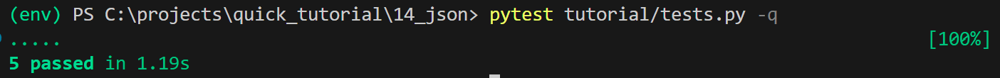
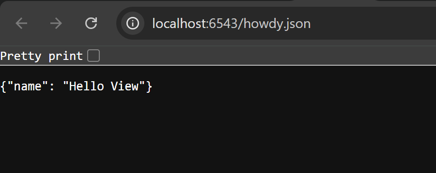

# 14: AJAX Development With JSON Renderers

## 📘 Deskripsi Singkat  
Di langkah ini kita akan bereksperimen dengan pengembangan aplikasi web modern yang menggunakan AJAX dan JSON sebagai format pertukaran data. Pyramid sudah menyediakan renderer JSON bawaan, yang memungkinkan view kita mengembalikan data Python (dictionary/lists) dan secara otomatis di-serialize ke JSON serta menetapkan `Content-Type` yang sesuai. :contentReference[oaicite:1]{index=1}  
Dengan pendekatan ini, aplikasi web tidak hanya menghasilkan HTML statis, tetapi juga menyediakan endpoint JSON yang dapat dipanggil oleh JavaScript (AJAX) di browser.

---

## 🎯 Tujuan Pembelajaran  
- Menambahkan route baru yang menghasilkan JSON (endpoint AJAX). :contentReference[oaicite:2]{index=2}  
- Mengubah view untuk mendukung dua route: satu untuk halaman HTML biasa, dan satu untuk respons JSON yang sama. :contentReference[oaicite:3]{index=3}  
- Menguji bahwa endpoint JSON benar-benar mengembalikan JSON dan `Content-Type: application/json`. :contentReference[oaicite:4]{index=4}  
- Memahami bagaimana renderer JSON bekerja di Pyramid dan bagaimana membuat view yang data-oriented.

---

## ⚙️ Langkah-Langkah Implementasi  
1. Salin hasil dari langkah sebelumnya (09: View Classes) ke direktori baru:  
   ```bash
   cd ..; cp -r view_classes json; cd json
   $VENV/bin/pip install -e .
   ``` :contentReference[oaicite:5]{index=5}  
2. Tambahkan route baru `hello_json` di file `json/tutorial/__init__.py`:

   ```python
   from pyramid.config import Configurator

   def main(global_config, **settings):
       config = Configurator(settings=settings)
       config.include('pyramid_chameleon')
       config.add_route('home', '/')
       config.add_route('hello', '/howdy')
       config.add_route('hello_json', '/howdy.json')
       config.scan('.views')
       return config.make_wsgi_app()
   ``` :contentReference[oaicite:6]{index=6}  
3. Ubah view di `json/tutorial/views.py` sehingga view yang sama dapat diakses melalui dua route — satu route HTML, satu route JSON:

   ```python
   from pyramid.view import (
       view_config,
       view_defaults
   )

   @view_defaults(renderer='home.pt')
   class TutorialViews:
       def __init__(self, request):
           self.request = request

       @view_config(route_name='home')
       def home(self):
           return {'name': 'Home View'}

       @view_config(route_name='hello')
       @view_config(route_name='hello_json', renderer='json')
       def hello(self):
           return {'name': 'Hello View'}
   ``` :contentReference[oaicite:7]{index=7}  
4. Tambahkan atau perbarui tes fungsional di `json/tutorial/tests.py` untuk memeriksa endpoint JSON baru:

   ```python
   import unittest
   from pyramid import testing

   class TutorialViewTests(unittest.TestCase):
       def setUp(self):
           self.config = testing.setUp()

       def tearDown(self):
           testing.tearDown()

       def test_home(self):
           from .views import TutorialViews
           request = testing.DummyRequest()
           inst = TutorialViews(request)
           response = inst.home()
           self.assertEqual('Home View', response['name'])

       def test_hello(self):
           from .views import TutorialViews
           request = testing.DummyRequest()
           inst = TutorialViews(request)
           response = inst.hello()
           self.assertEqual('Hello View', response['name'])


   class TutorialFunctionalTests(unittest.TestCase):
       def setUp(self):
           from tutorial import main
           app = main({})
           from webtest import TestApp
           self.testapp = TestApp(app)

       def test_home(self):
           res = self.testapp.get('/', status=200)
           self.assertIn(b'<h1>Hi Home View', res.body)

       def test_hello(self):
           res = self.testapp.get('/howdy', status=200)
           self.assertIn(b'<h1>Hi Hello View', res.body)

       def test_hello_json(self):
           res = self.testapp.get('/howdy.json', status=200)
           self.assertIn(b'{"name": "Hello View"}', res.body)
           self.assertEqual(res.content_type, 'application/json')
   ``` :contentReference[oaicite:8]{index=8}  
5. Jalankan tes:

   ```bash
   $VENV/bin/pytest tutorial/tests.py -q
````

Hasil yang diharapkan:

````
.....
5 passed in 0.47 seconds
``` :contentReference[oaicite:9]{index=9}  
6. Jalankan aplikasi:

```bash
$VENV/bin/pserve development.ini --reload
````

7. Buka browser ke `http://localhost:6543/howdy.json` — Anda akan melihat respons JSON seperti:

   ```json
   {"name": "Hello View"}
   ```

---

## 🧠 Analisis

* Dengan menambahkan `renderer='json'` pada route `hello_json`, view `hello` yang sama menghasilkan JSON ketika dipanggil via `/howdy.json`. Rendering otomatis JSON oleh Pyramid mengubah dictionary Python ke JSON dan menetapkan header `Content-Type: application/json`. ([Pylons Project Documentation][1])
* Pendekatan ini menunjukkan bagaimana view bisa menjadi *data-oriented* — hanya mengembalikan data (dictionary) dan bukan HTML langsung — membuat pengujian lebih mudah dan memungkinkan reuse untuk endpoint AJAX. ([Pylons Project Documentation][1])
* Dengan route berbeda (`/howdy` untuk HTML dan `/howdy.json` untuk JSON), aplikasi dapat melayani baik pengguna — yang melihat halaman HTML — maupun klien AJAX yang memerlukan data JSON.
* Karena JSON renderer built-in sudah cukup untuk banyak kasus, kita hanya perlu menyediakan data Python yang dapat di-serialize; jika butuh serialisasi khusus (misalnya `datetime`), kita bisa extend renderer. ([Pylons Project Documentation][1])

---

## 📋 Output yang Diharapkan





* Akses `http://localhost:6543/howdy.json` di browser atau via cURL → akan tampil:

  ```json
  {"name": "Hello View"}
  ```
* Header `Content-Type` akan menjadi `application/json`.
* Akses HTML endpoint `http://localhost:6543/howdy` tetap berfungsi seperti sebelumnya.
* Tes unit dan fungsional semua lulus.
* Struktur proyek kira-kira:

  ````
  json/
    setup.py
    development.ini
    tutorial/
      __init__.py
      views.py
      tests.py
      home.pt
      ...
  ``` :contentReference[oaicite:13]{index=13}  
  ````

---
