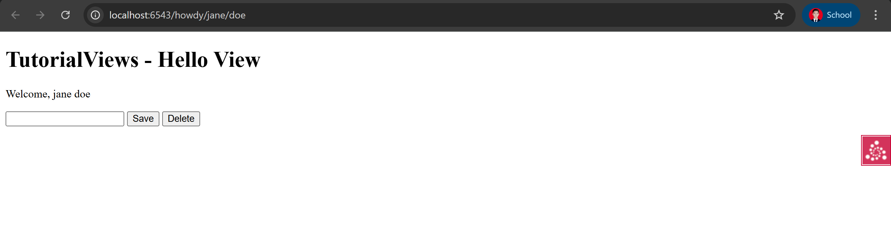
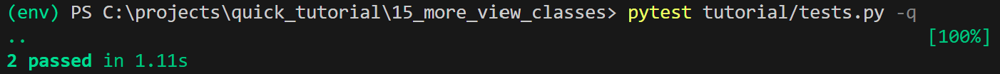

Berikut adalah **`README.md`** lengkap untuk bagian **15: More With View Classes** dari tutorial Pyramid. Kamu tinggal salin dan tempel saja ke file `README.md` di proyekmu:

````markdown
# Pyramid Quick Tutorial — 15: More With View Classes

## Deskripsi Singkat  
Pada tahap ini kita akan belajar bagaimana mengelompokkan view-view terkait ke dalam sebuah *view class* (kelas tampilan) di Pyramid. Dengan menggunakan kelas tampilan kita dapat:

- Mengelompokkan view-view yang saling terkait (misalnya operasi untuk satu entitas atau REST API)  
- Menyentralisasi konfigurasi bersama menggunakan `@view_defaults` di level kelas  
- Berbagi state dan helper logic antar metode view di kelas yang sama  
- Menggunakan predikat view (seperti `request_method`, `request_param`) untuk memilih view mana yang akan menanggapi request  

Dengan demikian, struktur kode menjadi lebih terorganisir, lebih DRY (Don’t Repeat Yourself), dan lebih mudah dikelola.

## Langkah-Langkah  
1. Mulailah dari hasil langkah sebelumnya (“templating”). Misalnya:  
   ```bash
   cd ..
   cp -r templating more_view_classes
   cd more_view_classes
   $VENV/bin/pip install -e .
````

([Pylons Project Documentation][1])
2. Ubah konfigurasi route di `more_view_classes/tutorial/__init__.py` menjadi seperti berikut:

```python
from pyramid.config import Configurator

def main(global_config, **settings):
    config = Configurator(settings=settings)
    config.include('pyramid_chameleon')
    config.add_route('home', '/')
    config.add_route('hello', '/howdy/{first}/{last}')
    config.scan('.views')
    return config.make_wsgi_app()
```

([Pylons Project Documentation][1])
3. Buat atau ubah file `more_view_classes/tutorial/views.py` dengan kelas tampilan seperti ini:

```python
from pyramid.view import view_config, view_defaults

@view_defaults(route_name='hello')
class TutorialViews:
    def __init__(self, request):
        self.request = request
        self.view_name = 'TutorialViews'

    @property
    def full_name(self):
        first = self.request.matchdict['first']
        last = self.request.matchdict['last']
        return first + ' ' + last

    @view_config(route_name='home', renderer='home.pt')
    def home(self):
        return {'page_title': 'Home View'}

    @view_config(renderer='hello.pt')
    def hello(self):
        return {'page_title': 'Hello View'}

    @view_config(request_method='POST', renderer='edit.pt')
    def edit(self):
        new_name = self.request.params['new_name']
        return {'page_title': 'Edit View', 'new_name': new_name}

    @view_config(request_method='POST', request_param='form.delete',
                 renderer='delete.pt')
    def delete(self):
        print('Deleted')
        return {'page_title': 'Delete View'}
```

([Pylons Project Documentation][1])
4. Buat atau ubah template-template di `more_view_classes/tutorial/` sebagai berikut:

* `home.pt`

  ```html
  <!DOCTYPE html>
  <html lang="en">
  <head>
    <title>Quick Tutorial: ${view.view_name} - ${page_title}</title>
  </head>
  <body>
    <h1>${view.view_name} - ${page_title}</h1>
    <p>Go to the <a href="${request.route_url('hello', first='jane', last='doe')}">form</a>.</p>
  </body>
  </html>
  ```

  ([Pylons Project Documentation][1])
* `hello.pt`

  ```html
  <!DOCTYPE html>
  <html lang="en">
  <head>
    <title>Quick Tutorial: ${view.view_name} - ${page_title}</title>
  </head>
  <body>
    <h1>${view.view_name} - ${page_title}</h1>
    <p>Welcome, ${view.full_name}</p>
    <form method="POST" action="${request.current_route_url()}">
      <input name="new_name"/>
      <input type="submit" name="form.edit" value="Save"/>
      <input type="submit" name="form.delete" value="Delete"/>
    </form>
  </body>
  </html>
  ```

  ([Pylons Project Documentation][1])
* `edit.pt`

  ```html
  <!DOCTYPE html>
  <html lang="en">
  <head>
    <title>Quick Tutorial: ${view.view_name} - ${page_title}</title>
  </head>
  <body>
    <h1>${view.view_name} - ${page_title}</h1>
    <p>You submitted <code>${new_name}</code></p>
  </body>
  </html>
  ```

  ([Pylons Project Documentation][1])
* `delete.pt`

  ```html
  <!DOCTYPE html>
  <html lang="en">
  <head>
    <title>Quick Tutorial: ${page_title}</title>
  </head>
  <body>
    <h1>${view.view_name} - ${page_title}</h1>
  </body>
  </html>
  ```

  ([Pylons Project Documentation][1])

5. Ubah atau tambahkan pengujian (tests) di `more_view_classes/tutorial/tests.py` seperti ini:

   ```python
   import unittest
   from pyramid import testing

   class TutorialViewTests(unittest.TestCase):
       def setUp(self):
           self.config = testing.setUp()

       def tearDown(self):
           testing.tearDown()

       def test_home(self):
           from .views import TutorialViews
           request = testing.DummyRequest()
           inst = TutorialViews(request)
           response = inst.home()
           self.assertEqual('Home View', response['page_title'])

   class TutorialFunctionalTests(unittest.TestCase):
       def setUp(self):
           from tutorial import main
           app = main({})
           from webtest import TestApp
           self.testapp = TestApp(app)

       def test_home(self):
           res = self.testapp.get('/', status=200)
           self.assertIn(b'TutorialViews - Home View', res.body)
   ```

   ([Pylons Project Documentation][1])
6. Jalankan pengujian:

   ```bash
   $VENV/bin/pytest tutorial/tests.py -q
   ```

   Hasil: dua pengujian berhasil. ([Pylons Project Documentation][1])
7. Jalankan aplikasi Pyramid dengan reload:

   ```bash
   $VENV/bin/pserve development.ini --reload
   ```

   Kemudian buka browser ke `http://localhost:6543/howdy/jane/doe`, lalu klik tombol *Save* dan *Delete*. ([Pylons Project Documentation][1])

## Analisis

* Semua view (home, hello, edit, delete) kini berada dalam satu kelas (`TutorialViews`), sehingga logika dan konfigurasi bersama dapat dikelompokkan bersama. ([Pylons Project Documentation][1])
* Konfigurasi default kelas dilakukan dengan `@view_defaults(route_name='hello')`, yang berarti semua metode akan menggunakan route `'hello'` kecuali di-override (contoh: metode `home`). ([Pylons Project Documentation][1])
* Dua metode (`edit` dan `delete`) dipetakan ke `POST`, dan `delete` menggunakan tambahan predikat `request_param='form.delete'`. Ini menunjukkan bagaimana memilih view berdasarkan HTTP method dan parameter form. ([Pylons Project Documentation][1])
* Kelas tampilan memungkinkan berbagi state (misalnya `self.request`, `self.view_name`) dan helper (property `full_name`) yang dapat digunakan dalam template. ([Pylons Project Documentation][1])
* Template kini menggunakan `request.route_url(...)` untuk menghasilkan URL secara dinamis dan tidak lagi hard-coded. Hal ini membuat routing lebih fleksibel. ([Pylons Project Documentation][1])
* Dengan pola ini, struktur aplikasi menjadi lebih modular dan bersih ketika skenario view menjadi lebih kompleks (misalnya banyak operasi CRUD, REST endpoints, dll).

## Output yang Diharapkan





* Saat membuka `http://localhost:6543/` → muncul halaman *Home View* dengan judul “TutorialViews – Home View” dan link ke form.
* Klik link ke `/howdy/jane/doe` → muncul halaman *Hello View* dengan teks “Welcome, jane doe” dan form yang memiliki dua tombol: *Save* dan *Delete*.
* Submit form dengan mengisi `new_name` dan klik *Save* → diarahkan ke halaman *Edit View* yang menampilkan “You submitted `<new_name>`”.
* Submit form dan klik *Delete* → diarahkan ke halaman *Delete View* (judul “TutorialViews – Delete View”). Di console server seharusnya muncul output `Deleted`.
* Semua test unit dan functional harus lulus.

